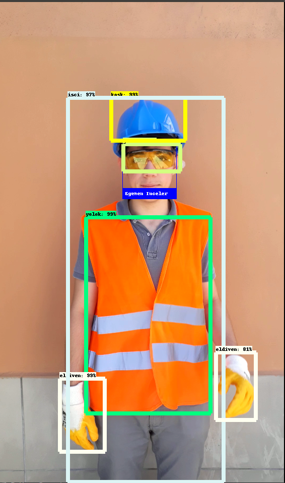

# Safe Workers

! Model files for object detection will be added. 

Built using Tensorflow's Faster RCNN model for object detection and using Ageitgey's face_recognition API for face recognition.

### Dockerfile implementation will be added. Researching CUDA/Docker relation.

Installation Guide 

Object detection icin kullanilan repository : 

https://github.com/EdjeElectronics/TensorFlow-Object-Detection-API-Tutorial-Train-Multiple-Objects-Windows-10

Face recognition icin kullanilan repository :

https://github.com/ageitgey/face_recognition

Bu installation guide'i Linux tabanli distrolar ve macOS icin hazirlanmistir. 

Opencv kutuphanesinin kullandigi dlib kutuphanesi official olarak Windows tarafindan desteklenmiyor ama asagidaki linkten guide'i takip ederek indirmeyi deneyebilirsiniz. Ama object detection kismi windows 10 icin calisacaktir.

https://github.com/ageitgey/face_recognition/issues/175#issue-257710508

Ayrica macOS ve Windows 10 tarafinda tensorflow'un GPU destegi bulunmamakta. Only Linux!

Eger global python kutuphanelerini indirecekseniz apt-get ile indirmeniz daha mantikli olacaktir.

! Docker ile tensorflow kurulumu gelecek. Buraya eklerim. !

https://github.com/ageitgey/face_recognition/issues/175#issue-257710508

Ilk once object detection icin baslayacagim. Bu repoda modelin train edilmesi gibi kisimlar icin neler yapilmasi hakkinda bilgi verilmis ama bizim modelimiz onceden egitilmis  oldugundan dolayi burayi es gececegim. Modelinizi egitmek icin gereken adimlari repository'nin altinda bulabilirsiniz. 

Ben anaconda kurmadim ama modelinizi egitmeniz icin anaconda yuklemeniz gerekli olabilir. Repository altindaki README dosyasindan bakabilirsiniz.

Eger isletim sisteminiz de birden fazla python surumu yuklu ise virtual environment kurup 3.6 ve uzeri python executable'ini virtual environmenta belirtmeniz yeterli olacaktir. 

GPU'nuz CUDA destekliyor mu?  -> Kontrol etmek icin 
https://developer.nvidia.com/cuda-gpus

https://www.tensorflow.org/install/gpu

Yukaridaki adrese girdikten sonra tensorflow-gpu indirmesine baslayabilirsiniz. Indirdiginiz tensorflow versiyonunun software requirements kisminda belirtilmis indirmeniz gereken 3 tane yazilim bulunmakta. (4. yazilim opsiyonel)

NVidia driver  - https://www.nvidia.com/Download/index.aspx?lang=en-us
CUDA - https://developer.nvidia.com/cuda-toolkit-archive ( Software requirements altinda belirtilen CUPTI, CUDA Toolkit'i ile birlikte gelmekte)
cuDNN - https://developer.nvidia.com/cudnn

Bunlari indirdikten sonra tensorflow'un object detection kisminda yapilmasi gereken baska islemler var. 

https://github.com/tensorflow/models/blob/master/research/object_detection/g3doc/installation.md

Yukaridaki linki takip ederek COCO API'ye kadar belirtilmis dependency'leri indirin. 

Eger virtual environment kurmadiysaniz ve birden fazla python versiyonu yuklu ise pip3 kullaranak indirmeyi yapabilirsiniz.

Github uzerinden tensorflow/models'i indirin. https://github.com/tensorflow/models

Daha sonra asagidaki komutlari girmeniz yeterli olacaktir.

git clone https://github.com/cocodataset/cocoapi.gi
cd cocoapi/PythonAPI
make
cp -r pycocotools <path_to_tensorflow>/models/research/t

Bir sonraki asama protobuf compliation. Yine ayni sekilde indirdiginiz tensorflow dizini uzerinde komutunu calistirmaniz gerekli.

protoc object_detection/protos/*.proto --python_out=.

Eger hata aliyorsaniz protobuf-compiler'i elle indirmeniz gerekebilir.

Son olarak kutuphaneleri PYTHONPATH'ine eklemek kaldi. Yine tensorflow'u indirdiginiz dizin altinda asagidaki komutu calistirdiktan sonra PYTHONPATH'ine eklenecektir.

export PYTHONPATH=$PYTHONPATH:`pwd`:`pwd`/slim  

Asagidaki komutu kullanarak pathinizi kontrol edebilirsiniz.

echo $PYTHONPATH

Face recognition yukleme dokumanini asagidaki linkten takip edebilirsiniz.

https://github.com/ageitgey/face_recognition#installation

Ilk once dlib kutuphanesini indirecegiz. Linux tarafinda ilk once asagidaki linkten ulasacagiz sari renkle gosterilmis RUN komutu ile belirtilmis dependencyleri indirmeniz gerekmekte. 

https://github.com/ageitgey/face_recognition/blob/master/Dockerfile#L6-L34

These instructions assume you don't have an nVidia GPU and don't have Cuda and cuDNN installed and don't want GPU acceleration (since none of the current Mac models support this).

Yukaridaki yazi itibariyle Dockerfile icinde bulunan ve indirdigimiz dependency'ler gercekten gerekli olmayabilir. Indirmeyip denemedigimden dolayi bir sey diyemiyorum. 

Bu dependency'leri indirdikten sonra asagidaki komutlari sirasiyla calistirdiktan sonra dlib'i import edebilirsiniz.

git clone https://github.com/davisking/dlib.git
cd dlib
mkdir build; cd build; cmake ..; cmake --build .
cd ..
python3 setup.py install

Daha sonra pip3 ile modulu indiriyoruz.

pip3 install face_recognition

python developerLayer.py veya python3 developerLayer.py komutu ile (input olarak vereceginiz video varsayilan ana dizinde) calistirabilirsiniz.

pip ve pip3 arasindaki farklar buraya sonra eklenecek!

Karsilasabilecek hatalar

PYTHONPATH'iniz yanlis olabilir. Kontrol edin.

Indirmeniz gerekebilecek kutuphaneler

Scipy, Numpy, Pickle (Normalde standart python kutuphanesi icinde gelmekte ama ben de hata verdi, pip3 ile tekrar indirdim), opencv-python, scikit-learn, matplotlib

Eger utils module not found diye bir hata alirsaniz 

Dosyanin icerisinde bulunan
from utils import ... 
yerine 
from object_detection.utils import ... 
yazmaniz sorunu cozebilir.
